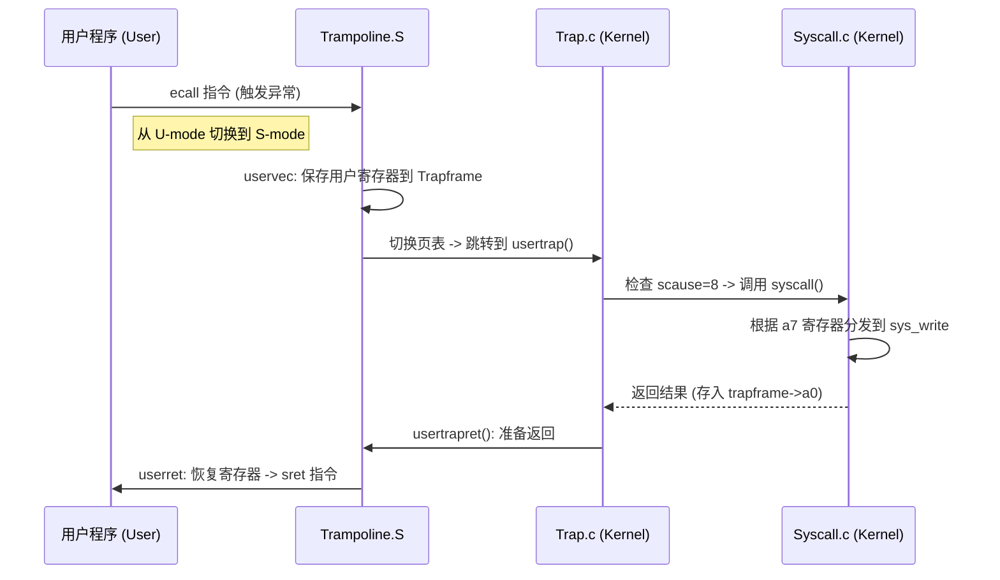

这是 **从零构建操作系统 (riscv-os)** 的第六个实验阶段。
在本实验中，我们打破了内核的壁垒，实现了**用户态（User Mode）**与**内核态（Kernel Mode）**的安全隔离与交互机制。操作系统现在能够运行受限的用户进程，并通过系统调用请求内核服务。

## 实验目标
1.  **特权级切换**：实现用户态到内核态的上下文切换机制（Trap Mechanism）。
2.  **内存隔离**：建立用户虚拟地址空间布局，包括特殊的 `TRAMPOLINE` 和 `TRAPFRAME` 映射。
3.  **系统调用框架**：实现 `syscall` 分发器，处理 `ecall` 指令。
4.  **核心系统调用**：实现 `fork` (进程创建), `wait` (进程回收), `exit` (进程退出), `write` (输出), `getpid` 等基础调用。
5.  **安全检查**：确保用户程序不能访问内核内存（基于页表权限位 `PTE_U` 的检查）。

## 完成功能特性

- **Trap 机制**：编写了 `trampoline.S` 汇编代码，实现了 `uservec`（保存用户上下文）和 `userret`（恢复用户上下文）。
- **内存映射**：在内核页表和用户页表的最高地址（`MAXVA`）处统一映射了跳板页（Trampoline），解决了页表切换时的地址连续性问题。
- **参数传递**：实现了 `argint`, `argaddr` 等辅助函数，从 Trapframe 的寄存器（`a0`-`a7`）中提取系统调用参数。
- **安全数据传输**：实现了 `copyin`/`copyout`，在内核与用户空间传输数据时严格检查 `PTE_U` 权限，防止恶意指针攻击。
- **综合测试**：编写了用户态测试程序 `systest.c`，全面验证功能与安全性。

## 技术架构：Trap 处理流

当用户程序执行系统调用（如 `write`）时，CPU 的执行流如下：



## 关键文件说明

| 文件路径 | 说明 |
| :--- | :--- |
| `kernel/trampoline.S` | **核心汇编**：用户态与内核态切换的跳板代码 |
| `kernel/trap.c` | **中断处理**：`usertrap` (处理异常/系统调用) 和 `usertrapret` (返回用户态) |
| `kernel/syscall.c` | **分发器**：定义系统调用号与处理函数的映射，参数解析 |
| `kernel/sysproc.c` | **进程类实现**：`sys_fork`, `sys_exit`, `sys_wait`, `sys_getpid` 等 |
| `kernel/vm.c` | **内存安全**：`copyin`/`copyout` 及其权限检查逻辑 |
| `user/systest.c` | **测试程序**：专门用于测试各项系统调用的 C 语言程序 |

## 编译与运行

由于系统调用的测试依赖于进程加载（Exec），本分支已包含基础的文件系统支持。

```bash
# 编译并启动 QEMU
make qemu
```

系统启动后，`init` 进程会自动加载并运行 `systest` 测试程序。

## 测试结果与分析

以下是 `systest` 在 QEMU 中的实际运行输出：

```text
=== Starting Lab 6 System Call Tests ===
[TEST] Basic Syscalls (getpid, fork, wait, exit)...
  Current PID: 2
  Child exiting with magic status 88...
  Parent received correct status: 88
PASSED
[TEST] Parameter Passing (write)...
Hello
PASSED
[TEST] Security (Invalid Pointers)...
  Write to kernel addr handled correctly (ret=-1)
  Read to kernel addr handled correctly (ret=-1)
PASSED
[TEST] System Call Performance...
  100000 getpid() calls took 1246 ms
  Average: 12.4 us per call
PASSED
=== All Lab 6 Tests Passed! ===
```

### 结果解读
1.  **基础功能 (Basic)**：
    *   测试了 `fork` 创建子进程，子进程通过 `exit(88)` 退出。
    *   父进程通过 `wait` 成功捕获到了状态码 **88**，证明进程间通信（IPC）和生命周期管理逻辑正确。
2.  **参数传递 (Parameter)**：
    *   `write` 成功输出了字符串，证明内核能正确从用户栈读取数据指针和长度。
3.  **安全性 (Security)**：
    *   测试程序尝试向内核地址 `0x80000000` 写入数据。
    *   内核**没有崩溃**，而是返回了 `-1`。这证明 `walkaddr` 成功拦截了非法指针（检测到该地址没有 `PTE_U` 权限）。
4.  **性能 (Performance)**：
    *   单次空载系统调用 (`getpid`) 耗时约 **12.4 微秒**。
    *   这表明 Trap 处理路径（寄存器保存/恢复、页表切换）效率很高，没有不必要的性能损耗。

---